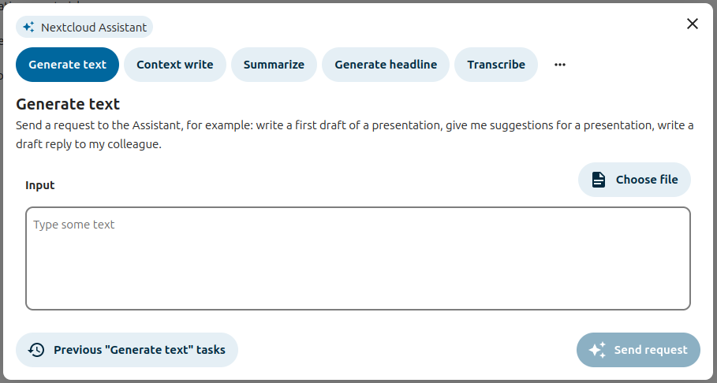
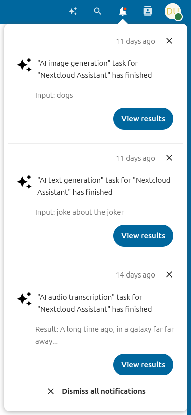
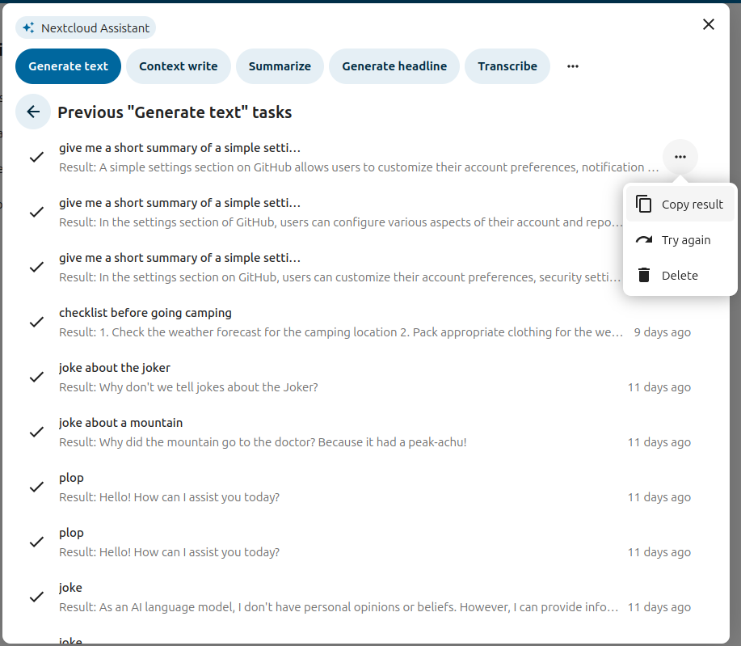
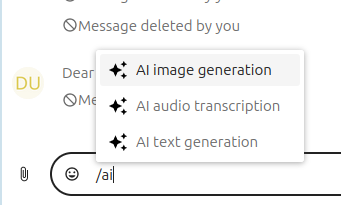
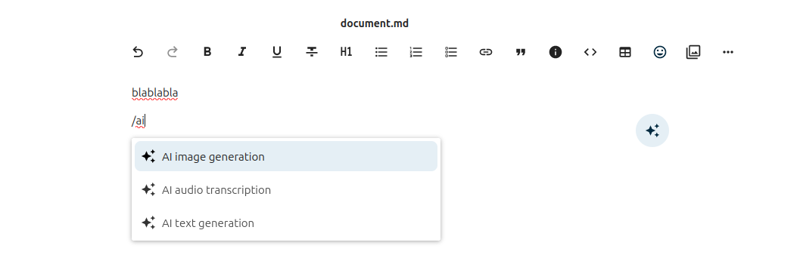
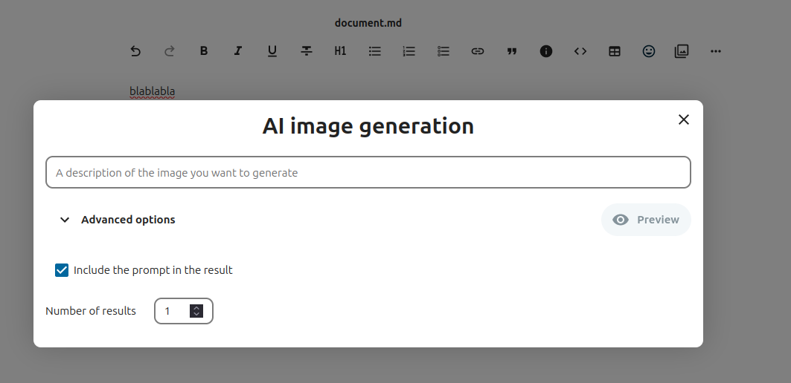
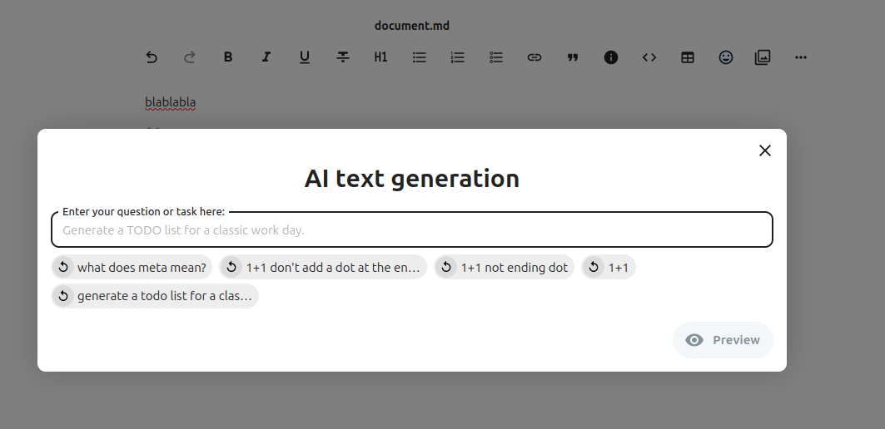

<!--
  - SPDX-FileCopyrightText: 2024 Nextcloud GmbH and Nextcloud contributors
  - SPDX-License-Identifier: AGPL-3.0-or-later
-->
# User documentation

## Personal settings

The Assistant personal settings can be found under the "Artificial intelligence" section.
You can disable the assistant top menu entry there. You can also disable the AI-related smart pickers.

## Assistant

### Run a task

To run a task with the Assistant, just open it via the top menu entry (on the top right).

Then choose a task type at the top of the assistant.
Then fill up the input form and press the submit button at the bottom right.

You task will run immediately if possible or be scheduled for later execution.

### Notifications

If the task was scheduled, you will receive a notification when it has finished.
You can display the task results by clicking the "View results" button in the notification.

### History

On the bottom left corner of the assistant, there is a button to display the task history.
This task history is filtered to only show tasks of the currently selected task type.
You can then relaunch previous tasks, delete them or just cancel them if they were scheduled.

## Smart picker

The assistant app provides 3 smart pickers that you can access in Talk,
Text and in every place where rich text edition is possible.
To use them, type "/" and then "ai". They will appear in the filtered provider list.

In Talk:

In Text:

The pickers:

If possible, the picker result will be directly inserted in the current context.
